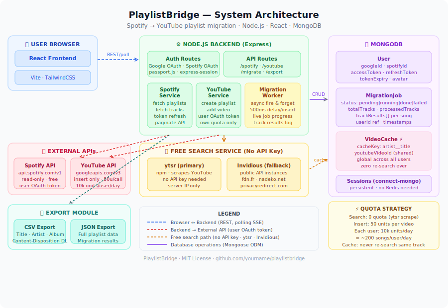
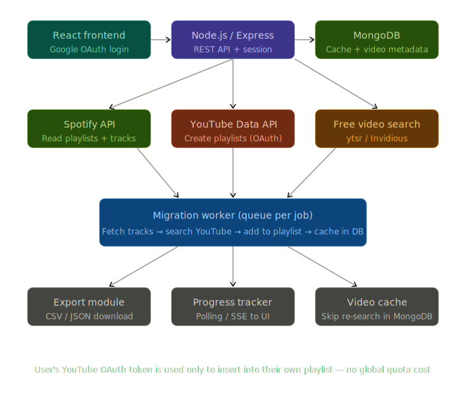
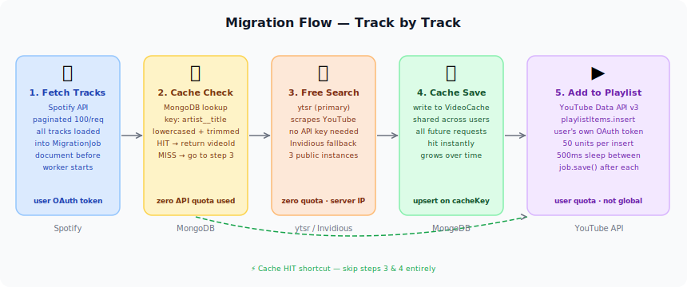

# 🎵 PlaylistBridge

### Migrate your Spotify playlists to YouTube — one click, no limits

**Sign in with Google · Connect Spotify · Choose playlists · Done.**  
Export to CSV/JSON · Download track lists · Free YouTube search via ytsr + Invidious

---

## 📐 System Architecture

---

## 🔀 Migration Flow — Track by Track

---

## ✨ Features

| Feature | Detail |
|---|---|
| **One-click migration** | Select Spotify playlists → pick or create a YouTube playlist → go |
| **Free YouTube search** | Uses `ytsr` (npm scraper) + Invidious public API — zero API key needed for search |
| **Global video cache** | MongoDB `VideoCache` collection — once a track is looked up, every future user gets it instantly |
| **Export playlists** | Download any Spotify playlist as CSV or JSON — track, artist, album |
| **Migration results export** | Download a CSV/JSON of what was migrated and what wasn't found |
| **Live progress** | Polling endpoint shows per-track status in real time while the worker runs |
| **No Redis** | MongoDB handles sessions (connect-mongo), caching, and job state — no extra infra |
| **Per-user quota** | YouTube inserts use each user's own OAuth token so no global quota is burned |

---

## 🧩 Key Design Decisions

### Why no Redis?
MongoDB with `connect-mongo` handles sessions with persistence and TTL indexes. `VideoCache` is a permanent store (not ephemeral), so a cache layer adds no value. One less infra dependency.

### Why fire-and-forget for migration?
Migrations can take minutes for large playlists. Holding an HTTP connection open that long is fragile. The route creates the job, kicks off the worker without `await`, and returns `{ jobId }` immediately. The frontend polls the status endpoint every 2 seconds.

### Why use the user's own YouTube OAuth token?
Using a global service account would hit a shared 10k unit/day ceiling immediately at scale. Each authenticated user brings their own 10k units. For a typical 50-track playlist (50 × 50 = 2,500 units), a user can migrate ~4 playlists per day — far more practical.

### Why ytsr + Invidious?
`ytsr` is a well-maintained npm package that scrapes YouTube's search results without any authentication or API key. Invidious is a network of YouTube front-end mirrors that expose a free REST API. Neither consumes YouTube Data API quota. Combined with MongoDB caching, the same track is never searched twice across the entire user base.

---

## 🗺 Roadmap

- [ ] Batch migration — queue multiple playlists at once
- [ ] Smart matching — fuzzy match on title when exact search fails
- [ ] Playlist sync — detect new Spotify tracks and add them to YouTube
- [ ] Apple Music support
- [ ] Browser extension for one-click migration from Spotify web player

---

## 📄 License

@MIT LICENSE — see [LICENSE](LICENSE)

---

Made with ❤️ · Spotify → YouTube · No API key needed for search

